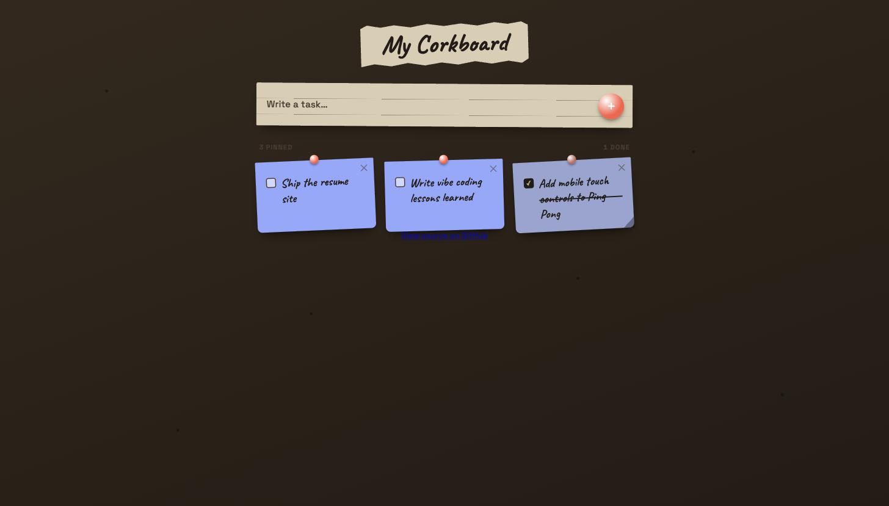

# My Corkboard

A sticky-note style to-do app built in React + TypeScript. Notes pin to a corkboard, persist to `localStorage`, and each one gets a random color and tilt.



**Live demo:** https://gamaltawaf.github.io/to-do/

## Features

- Add, complete, and delete notes
- Persisted locally — no backend, no account
- Playful, hand-pinned visual style

## Run locally

```bash
npm install
npm run dev
```

## Build

```bash
npm run build
```

## Deploy

```bash
npm run deploy
```

Publishes `dist/` to the `gh-pages` branch.
